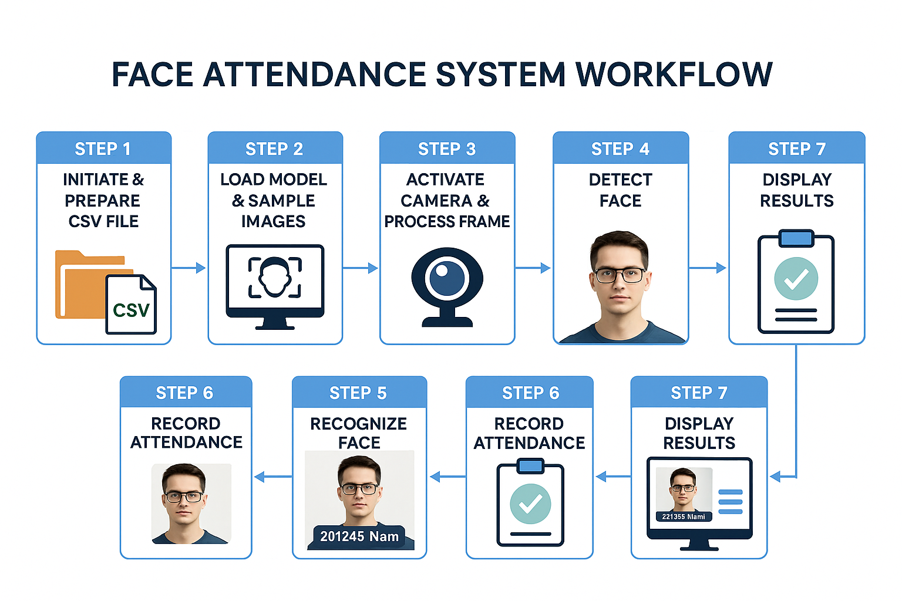

# Hệ Thống Điểm Danh Tự Động Dựa Trên Nhận Dạng Khuôn Mặt Sử Dụng YOLOv8m-face

Hệ thống điểm danh tự động này sử dụng mô hình YOLOv8m-face, một phiên bản YOLOv8 được tối ưu hóa đặc biệt cho việc nhận diện khuôn mặt, với độ chính xác và tốc độ xử lý vượt trội. Hệ thống cho phép nhận diện và điểm danh người tham gia một cách tự động và chính xác, giúp tiết kiệm thời gian và nâng cao hiệu quả công việc.

## Sơ Đồ Quy Trình

### Các Bước Chính:

1. **Phát hiện khuôn mặt (Face Detection)**  
   Sử dụng mô hình YOLOv8m-face để phát hiện vị trí khuôn mặt trong video hoặc hình ảnh đầu vào theo thời gian thực. Quá trình này đảm bảo nhận diện nhanh chóng và chính xác ngay cả khi có nhiều khuôn mặt trong khung hình.

2. **Trích xuất đặc trưng khuôn mặt (Feature Extraction)**  
   Sau khi phát hiện khuôn mặt, các thuật toán embedding được áp dụng để chuyển đổi khuôn mặt phát hiện thành một vector đặc trưng số hóa. Các thuật toán này giúp mô hình hiểu và phân biệt được các khuôn mặt khác nhau một cách chính xác.

3. **So sánh và nhận dạng (Face Recognition)**  
   Vector đặc trưng được so sánh với cơ sở dữ liệu khuôn mặt đã đăng ký. Quá trình này giúp xác định chính xác danh tính của người tham gia dựa trên các đặc điểm khuôn mặt đã được lưu trữ.

4. **Điểm danh tự động (Automated Attendance)**  
   Khi khuôn mặt được nhận dạng thành công, hệ thống ghi lại thời gian và danh sách điểm danh. Điều này giúp quản lý attendance một cách chính xác và nhanh chóng, tự động hóa hoàn toàn quy trình điểm danh.

   

### Công Nghệ và Thư Viện

- **YOLOv8m-face**: Mô hình phát hiện khuôn mặt nhẹ, hiệu quả và nhanh chóng.
- **OpenCV**: Thư viện mạnh mẽ cho việc xử lý video và hình ảnh, giúp phát hiện và theo dõi khuôn mặt trong video theo thời gian thực.
- **DeepFace / Facenet**: Sử dụng các thuật toán nhận dạng khuôn mặt để trích xuất embedding khuôn mặt và so sánh với cơ sở dữ liệu.
- **Python**: Ngôn ngữ lập trình chính để triển khai hệ thống và các thuật toán xử lý ảnh.

### Ưu Điểm

- **Tốc độ và độ chính xác cao**: Hệ thống có thể xác thực nhanh chóng và chính xác ngay cả trong môi trường thực tế với ánh sáng và góc nhìn đa dạng.
- **Xử lý đa khuôn mặt**: Hệ thống có khả năng nhận diện và xử lý nhiều khuôn mặt cùng lúc, tiết kiệm thời gian khi xử lý nhóm đông người.
- **Khả năng làm việc trong nhiều điều kiện**: Hệ thống hoạt động hiệu quả trong điều kiện ánh sáng khác nhau và góc nhìn đa dạng, phù hợp cho nhiều môi trường khác nhau như lớp học, sự kiện, v.v.

## Cách Thức Hoạt Động

Hệ thống tự động điểm danh khi khuôn mặt của người tham gia được nhận diện và so sánh với cơ sở dữ liệu. Quá trình này giúp đảm bảo tính chính xác và không bị gián đoạn, đồng thời tiết kiệm thời gian cho người quản lý.

1. **Kết nối và xử lý dữ liệu video**: Hệ thống sẽ kết nối với camera và tiếp nhận dữ liệu video trực tiếp.
2. **Phát hiện khuôn mặt**: Mô hình YOLOv8m-face sẽ nhận diện và định vị các khuôn mặt trong video.
3. **Trích xuất đặc trưng khuôn mặt và nhận dạng**: Các đặc trưng khuôn mặt sẽ được trích xuất và so sánh với cơ sở dữ liệu.
4. **Điểm danh tự động**: Khi nhận diện thành công, hệ thống sẽ tự động ghi lại thông tin điểm danh của người tham gia.

## Hướng Dẫn Cài Đặt và Sử Dụng

1. **Cài Đặt Môi Trường Phát Triển**:
   - Cài đặt các thư viện cần thiết: `opencv-python`, `deepface`, `yolov8m-face` (hoặc các phiên bản phù hợp của YOLO).
   - Cài đặt Python 3.x và các thư viện hỗ trợ.

2. **Chạy Hệ Thống**:
   - Sau khi cài đặt xong, chỉ cần chạy tệp mã nguồn Python đã chuẩn bị sẵn để bắt đầu điểm danh khuôn mặt.
   - Đảm bảo rằng hệ thống có quyền truy cập vào camera hoặc nguồn video trực tiếp.

3. **Kiểm Tra và Cập Nhật Cơ Sở Dữ Liệu Khuôn Mặt**:
   - Cập nhật cơ sở dữ liệu khuôn mặt bằng cách thêm ảnh khuôn mặt của người tham gia vào hệ thống.
   - Quá trình này sẽ giúp hệ thống nhận diện và điểm danh chính xác hơn.

### Liên Hệ
- **Tác giả**: [Nguyễn Duy Quang](https://github.com/j1weng1923)
- **Email**: [quangduy1923@gmail.com](mailto:email@example.com)

Chúc bạn thành công với dự án điểm danh tự động sử dụng YOLOv8m-face!
